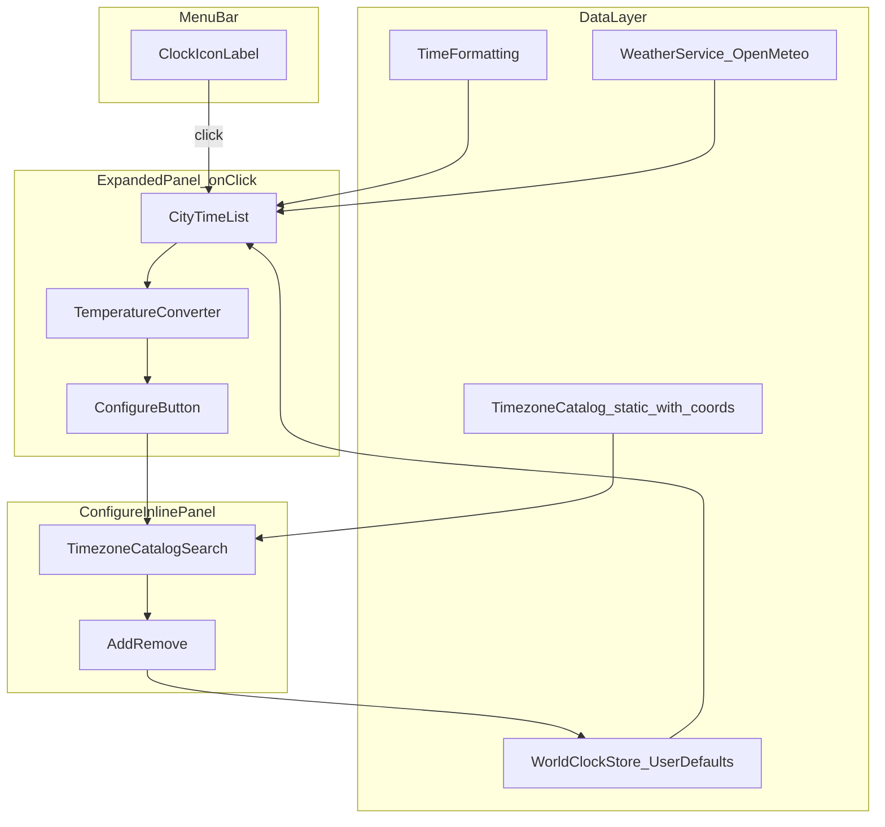

# Mac World Clock Menu Bar App

## Current status

**v2 complete** — weather display with dual °C / °F on main rows and a main-panel temperature converter are implemented and buildable.

| Area | Status |
|------|--------|
| Menu bar icon + click-to-open panel | Done |
| Live clock list with offset vs local | Done |
| Day/night sun/moon icon per timezone row | Done |
| Per-city weather (Open-Meteo temp + condition icon) | Done |
| Dual °C / °F on main panel rows | Done |
| Main-panel °C ↔ °F temperature converter | Done |
| Inline configure (search, add/remove, max 10) | Done |
| Alphabetical city list (main + configure) | Done |
| Immediate UserDefaults persistence | Done |
| Launch at login (`SMAppService`, configure toggle) | Done |
| Export / import city list as JSON backup | Done |
| `.app` bundle script (`scripts/build-app.sh`) | Done |
| README + build docs | Done |
| Manual QA (DST, locale, persistence, login item, weather offline) | Pending — not automated |

**Stack:** Swift 5.9, SwiftUI, macOS 13+, SPM executable (no Xcode project). Bundle ID `com.cktools.macclockwidget`, display name **World Clock** (`Resources/Info.plist` **2.0.0**).

**Run:** `swift build -c release && .build/release/MacClockWidget` for dev; `./scripts/build-app.sh run` for `.app` + launch-at-login.

## Goal

A lightweight macOS **menu bar** app (top-of-screen status area) that:
- Shows a **clock icon only** when collapsed
- Opens an **expanded panel on click** (no hover behavior)
- Lists up to **10 cities/countries** with current time and **offset vs your local time** in parentheses
- Includes a **Configure** button at the bottom to add/remove timezones from a curated catalog (alphabetical list)

## Recommended stack

| Choice | Rationale |
|--------|-----------|
| **Swift + SwiftUI** | Best fit for modern menu bar apps on macOS |
| **`MenuBarExtra` + `.window` style** | Click opens a proper panel (not a tiny dropdown menu) |
| **Swift Package Manager** | Matches your existing ToggleDock pattern — no Xcode project required |
| **Foundation `TimeZone`** | Built-in IANA timezone support; no external deps |
| **`UserDefaults`** | Simple persistence for selected cities (max 10) |
| **`.accessory` activation policy** | Menu-bar-only app; no Dock icon |

**Minimum macOS:** 13.0 (required for `MenuBarExtra` window style).

## Architecture



## Project layout

```
Mac Clock Widget/
├── Package.swift
├── README.md
├── Resources/
│   └── Info.plist                # bundle metadata for build-app.sh (.app)
├── scripts/
│   ├── build-app.sh              # wrap binary in .app bundle; install/run targets
│   └── generate-catalog-coords.py  # one-time geocode helper for catalog lat/lon
└── Sources/MacClockWidget/
    ├── MacClockWidgetApp.swift   # @main, MenuBarExtra, .accessory policy
    ├── AppDelegate.swift         # NSApp.setActivationPolicy(.accessory)
    ├── Models/
    │   ├── WorldClockEntry.swift       # id, displayName, timeZoneIdentifier
    │   ├── WorldClockBackupDocument.swift  # versioned JSON backup envelope
    │   ├── TimeZoneCatalogEntry.swift    # catalog row: city, country, tz id, region, lat/lon
    │   └── WeatherSnapshot.swift         # cached temp (°C) + WMO weather code
    ├── Services/
    │   ├── WorldClockStore.swift         # load/save, enforce max 10, defaults
    │   ├── WorldClockBackupService.swift # export/import JSON via NSSavePanel/NSOpenPanel
    │   ├── LaunchAtLoginService.swift  # SMAppService.mainApp launch at login
    │   ├── TimeFormatting.swift          # time string, offset vs local, day/night
    │   ├── WeatherService.swift            # Open-Meteo batch fetch + 20 min cache
    │   ├── WeatherCoordinateResolver.swift # catalog coords + geocode fallback
    │   └── WeatherFormatting.swift         # WMO → SF Symbol, dual °C/°F display
    ├── Data/
    │   └── TimeZoneCatalog.swift         # 125 curated cities with coordinates
    └── Views/
        ├── ExpandedClockView.swift       # main panel: list + converter + configure (~380pt)
        ├── CityRowView.swift             # city, weather, sun/moon, time, offset
        ├── TemperatureConverterView.swift  # bidirectional °C ↔ °F footer
        └── ConfigureTimezonesView.swift    # searchable picker + remove
```

## Core behaviors

### 1. Menu bar item
- `MenuBarExtra` with `Image(systemName: "clock")` label
- `.menuBarExtraStyle(.window)` so click opens a fixed-size panel (~380×auto)

### 2. Expanded panel (click)
Each row shows:
- **Primary label:** city + country (e.g. `London, United Kingdom`); single line with tail truncation when the name exceeds available width
- **Sort order:** cities listed alphabetically by `displayName` (locale-aware, case-insensitive via `localizedStandardCompare`); same order in configure **Selected Cities** and on the main panel
- **Weather:** SF Symbol condition icon + dual temperature (e.g. `22°C / 72°F`) when Open-Meteo data is available; omitted while loading or offline
- **Day/night icon:** SF Symbol `sun.max.fill` (orange) or `moon.fill` (secondary) based on that timezone's local hour — daytime is 6:00–17:59 local (`TimeFormatting.isDaytime`)
- **Time:** formatted with system locale preferences (12h/24h follows macOS settings via `DateFormatter`)
- **Offset:** parenthesized difference vs local time, e.g. `(+5h)`, `(-3h 30m)`, or `(same time)`

Example row:
```
Tokyo, Japan     🌧 22°C / 72°F  ☀ 9:08 PM  (+14h)
```

- Weather fetched via Open-Meteo when the panel opens; cache refreshes every **20 minutes** (not tied to the 1s clock timer). No background polling when panel is closed.
- UTC rows skip weather (no meaningful single location).
- Empty state when no cities configured: short message + temperature converter + Configure button
- **Footer:** bidirectional **Temperature converter** (°C ↔ °F text fields) above **Configure…**; not shown in configure mode
- **Configure…** opens inline panel; keyboard shortcut **⌘,** from main panel (`ExpandedClockView`)
- Live updates via `TimelineView(.periodic(from:by: 1))` in the main panel (only while open — low CPU)
- `ExpandedClockView` owns `@StateObject` `WeatherService`; calls `refreshIfNeeded(for:)` on appear and when entries change

### 2b. Weather (`WeatherService`, `WeatherCoordinateResolver`, `WeatherFormatting`)
- **API:** Open-Meteo forecast (`https://api.open-meteo.com/v1/forecast`) — no API key; batch up to 10 cities in one request
- **Coordinates:** Catalog `latitude`/`longitude` per city; `TimeZoneCatalog.entry(matching:)` prefers `displayName` over timezone ID. Non-catalog entries geocoded once via Open-Meteo search and cached in UserDefaults (`weatherCoordinateCache`)
- **Storage:** Temperatures stored internally in **Celsius**; display shows both °C and °F via `WeatherFormatting.formattedBothTemperatures`; converter uses `fahrenheit(fromCelsius:)` / `celsius(fromFahrenheit:)`
- **Cache:** 20-minute in-memory cache per entry UUID; refresh only when main panel visible
- **Offline / error:** Row shows time + offset only; optional `"Weather unavailable"` caption when all rows fail
- **Attribution:** `"Weather data by Open-Meteo"` caption in configure footer

### 3. Offset calculation (`TimeFormatting`)
- Use `TimeZone.current` as local reference
- Compute offset in minutes between target timezone and local at **now** (handles DST correctly)
- Format human-readable:
  - `0` → `(same time)`
  - whole hours → `(+5h)` / `(-3h)`
  - partial hours → `(+5h 30m)`

### 4. Configure flow
- **Configure** button at bottom of expanded panel switches the same `MenuBarExtra` window to inline configure mode (`ConfigureTimezonesView`) — **not** a separate sheet, so add/remove actions keep the panel open
- **Done** or **Cancel** returns to the world-clock list; the panel stays open throughout configure interactions
- **Cancel** restores the city list as it was when configure opened; **Done** simply closes configure (changes are already saved)
- Panel width widens from ~380pt to **~420pt** while configure mode is active (`ExpandedClockView` toggles width; `ConfigureTimezonesView` uses a fixed 420×520 layout)
- Layout (top to bottom):
  1. **Selected Cities** — persisted list (alphabetical by name) with count badge (`N/10`), swipe-to-delete, and per-row **X** remove buttons (`xmark.circle.fill`)
  2. **Add City** — prominent inline search field + region-grouped catalog list
  3. **Footer** — **Launch at login** toggle, **Export…** / **Import…** backup buttons, Open-Meteo attribution, then **Cancel** (reverts to snapshot from panel open) and **Done** (dismiss configure)
- Features:
  - **Search** — inline `TextField` with magnifying glass above the catalog (reliable in menu bar panels; `.searchable` alone is omitted). Filters catalog by city, country, combined display name, IANA timezone identifier, and region using diacritic-insensitive `localizedStandardContains`. Clear button when text is non-empty. Empty-state message when no catalog rows match.
  - **Grouped list** by region (Americas, Europe, Africa, Asia, Oceania, Pacific) from catalog
  - **Add** city (disabled when 10 already selected; checkmark shown when already selected)
  - **Remove** selected entries via per-row **X** button in the Selected Cities list, swipe-to-delete (`List.onDelete`), or both — no iOS `EditMode`; native macOS `List` APIs only
  - **No manual reorder** — list order is always alphabetical by `displayName` (drag reorder removed; conflicts with alphabetical sort)
- Selected Cities section is **not** filtered by search (search targets the add-city catalog only)
- Prevent duplicate timezone IDs in the saved list

### 4b. Backup export / import (`WorldClockBackupService`)
- **Export:** **Export…** in configure footer opens `NSSavePanel`; writes pretty-printed JSON (`world-clock-cities.json` default name)
- **Import:** **Import…** opens `NSOpenPanel`; validates schema, timezones, and duplicates; replaces city list via ``WorldClockStore/setEntries(_:)`` (immediate persistence)
- **Schema:** ``WorldClockBackupDocument`` — `schemaVersion` (currently `1`), `exportedAt` (ISO8601), `entries` array of ``WorldClockEntry`` (`id`, `displayName`, `timeZoneIdentifier`)
- **Validation:** Rejects unsupported schema versions, empty lists, missing fields, unknown IANA timezone IDs; deduplicates by `timeZoneIdentifier`; caps at 10 entries
- **Cancel behavior:** Import before **Cancel** is reverted with other configure changes (snapshot from panel open)
- **Feedback:** Caption under Export/Import buttons for success or error (same pattern as launch-at-login errors)

### 5. Timezone catalog (`TimeZoneCatalog.swift`)
Static curated list of **125 cities** across **6 regions** (Americas, Europe, Africa, Asia, Oceania, Pacific) covering major cities/countries across IANA timezones. Each entry includes **latitude** and **longitude** for weather lookup. Lookup helper `entry(matching:)` prefers exact `displayName` match, then timezone ID fallback.

### 6. Persistence (`WorldClockStore`)
- **Storage:** `UserDefaults` key `worldClockEntries` — JSON-encoded `[WorldClockEntry]`
- **Load:** `WorldClockStore.init()` reads saved data on launch; `ExpandedClockView` owns a `@StateObject` store so the main panel always reflects persisted entries
- **Save timing:** Every mutation writes immediately — add, remove (X or swipe), and `setEntries` all sort alphabetically then call `save()`. No separate Save step required; closing the panel or quitting the app retains the latest list
- **Sort:** `sortEntriesInPlace()` runs after every mutation and on load (migrates existing saved order to alphabetical)
- **First launch only:** When no saved data exists (key absent or decode fails), applies defaults (local timezone + UTC + New York + London + Tokyo, up to 5) and persists them once
- **Limits:** Max 10 entries enforced on save; duplicate timezone IDs rejected on add
- **Survives restart:** Selections persist across app relaunch and login-item startup via the same UserDefaults key

### 7. App lifecycle
```swift
@main
struct MacClockWidgetApp: App {
    @NSApplicationDelegateAdaptor(AppDelegate.self) var appDelegate

    var body: some Scene {
        MenuBarExtra { ExpandedClockView() } label: {
            Image(systemName: "clock")
        }
        .menuBarExtraStyle(.window)
    }
}
```

`AppDelegate` sets `NSApp.setActivationPolicy(.accessory)` on launch (same pattern as menu-bar-only utilities).

### 8. Launch at login (`LaunchAtLoginService`)
- **API:** `ServiceManagement` framework — `SMAppService.mainApp` (macOS 13+; replaces legacy `SMLoginItemSetEnabled`)
- **UI:** **Launch at login** toggle in the configure panel footer, above **Cancel** / **Done** (`ConfigureTimezonesView.footer`)
- **Persistence:** `UserDefaults` key `launchAtLoginEnabled`; **default off** on first launch
- **Behavior:**
  - Toggle on → `SMAppService.mainApp.register()`; toggle off → `unregister(completionHandler:)`
  - Register/unregister errors surface as caption text under the toggle; failed toggles revert preference
  - On configure panel appear, `refreshFromSystemStatus()` syncs if the user changed Login Items in System Settings
- **`.app` bundle requirement:** `SMAppService` registers the main app bundle. Running the raw SPM binary (`.build/release/MacClockWidget`) is **not** a bundle — toggle is disabled with helper text. Use `scripts/build-app.sh` to produce `build/MacClockWidget.app` (bundle ID `com.cktools.macclockwidget`, ad-hoc signed) or `./scripts/build-app.sh install` for `/Applications`
- **Package:** link `ServiceManagement` in `Package.swift` (`linkerSettings: .linkedFramework("ServiceManagement")`)

## Build and run

```bash
cd "Mac Clock Widget"
swift build -c release
.build/release/MacClockWidget
```

Optional `scripts/build-app.sh` to produce `MacClockWidget.app` for double-click launch. **Launch at login** (in-app toggle or System Settings Login Items) requires the `.app` bundle — see section 8.

## UI polish (included in v1/v2)

- Main panel fixed width **~380pt**; configure mode widens to **~420pt**
- Native macOS spacing, dividers between sections
- Main panel footer: temperature converter above Configure button
- Inline configure panel:
  - Prominent rounded search field above the add-city catalog
  - `List` with `.inset` style, alternates row backgrounds
  - Selected Cities: swipe-delete (`onDelete`) and per-row X remove buttons (alphabetical order; no drag reorder)
  - Catalog: region section headers, Add button / checkmark for selected rows
  - Open-Meteo attribution caption in footer
  - Launch at login toggle above Cancel / Done footer; **⌘,** opens configure from main panel
- Accessibility labels on remove buttons and catalog actions
- City rows in main panel: accessibility labels for city, weather, time, and offset

## Implementation notes

| Area | Detail |
|------|--------|
| **Inline configure** | `ExpandedClockView` uses `@State isShowingConfigure` to swap between `mainPanel` and `ConfigureTimezonesView` inside the same `MenuBarExtra` window — no `.sheet` |
| **Immediate persistence** | Configure mutates `WorldClockStore` directly; add/remove auto-save to UserDefaults (alphabetical sort on each mutation). Cancel restores `entriesSnapshot` from panel open; Done dismisses without extra save |
| **Panel sizing** | `ExpandedClockView` sets outer frame width (380 vs 420); `ConfigureTimezonesView` inner frame 420×520 |
| **Weather** | `WeatherService` batch Open-Meteo fetch; 20 min cache; panel-open only; UTC skipped; dual °C/°F via `WeatherFormatting` |
| **Temperature converter** | `TemperatureConverterView` in main panel footer; bidirectional °C ↔ °F; session-only `@State`; shared conversion in `WeatherFormatting` |
| **Catalog coords** | 125 entries with lat/lon; `scripts/generate-catalog-coords.py`; `entry(matching:)` displayName-first |
| **List APIs** | macOS-native `List.onDelete` — no `EditMode`, no drag reorder (alphabetical order) |
| **Remove UX** | Dual path: `xmark.circle.fill` borderless button per selected row + swipe-to-delete on the same list |
| **Search** | `TimeZoneCatalog.filtered(by:)` delegates to `TimeZoneCatalogEntry.matchesSearch(_:)`; UI binding via `@State searchText` on inline `TextField` |
| **Catalog size** | 125 `TimeZoneCatalogEntry` rows in `TimeZoneCatalog.all`, grouped by `regionOrder` |
| **Persistence** | `WorldClockStore` JSON in UserDefaults key `worldClockEntries`, max 10 entries, duplicate timezone IDs rejected on add, alphabetical sort on every mutation and load |
| **Launch at login** | `LaunchAtLoginService` + `SMAppService.mainApp`; preference key `launchAtLoginEnabled` (default off); toggle in configure panel footer (not main panel); requires `.app` from `build-app.sh` |
| **Backup JSON** | `WorldClockBackupService` + `WorldClockBackupDocument`; Export/Import in configure footer; `NSSavePanel` / `NSOpenPanel`; schema version 1 |

## Out of scope for v1/v2

- Hover-to-open (per your preference: click only)
- iCloud sync across Macs
- Custom time formats (seconds, date line)
- Widget / Notification Center extension
- WeatherKit / paid weather APIs
- Hourly or multi-day forecast
- Per-row weather enable/disable toggle

## Implementation order

1. **Scaffold** — `Package.swift`, app entry, accessory policy, icon-only `MenuBarExtra` — **done**
2. **Data layer** — models, catalog, store with defaults, formatting helpers — **done**
3. **Expanded panel** — city rows, live clock updates, empty state — **done**
4. **Configure inline panel** — search, add/remove, max-10 enforcement, alphabetical list (stays within open `MenuBarExtra` window) — **done**
5. **Launch at login** — `LaunchAtLoginService`, configure-panel toggle, `SMAppService.mainApp`, `.app` bundle docs — **done**
6. **README** — build, run, launch at login, troubleshooting — **done**
7. **Weather + dual temperature** — Open-Meteo batch fetch, catalog coords, `22°C / 72°F` row display — **done**
8. **Manual test** — verify DST offsets, 12h/24h locale, persistence across relaunch, login item registration via `.app`, weather online/offline — **pending**

## Key APIs (verified approach)

- [`MenuBarExtra`](https://developer.apple.com/documentation/swiftui/menubarextra) — menu bar presence
- [`menuBarExtraStyle(.window)`](https://developer.apple.com/documentation/swiftui/scene/menubarextrastyle(_:)) — panel on click
- [`TimeZone`](https://developer.apple.com/documentation/foundation/timezone) + [`DateFormatter`](https://developer.apple.com/documentation/foundation/dateformatter) — timezone math and display
- [`NSApplication.setActivationPolicy(.accessory)`](https://developer.apple.com/documentation/appkit/nsapplication/activationpolicy/accessory) — hide Dock icon
- [`SMAppService.mainApp`](https://developer.apple.com/documentation/servicemanagement/smappservice/mainapp) — register/unregister launch at login (macOS 13+)
- [`List.onDelete`](https://developer.apple.com/documentation/swiftui/view/ondelete(perform:)) — swipe-delete on macOS

## Refinement ideas (post-v1)

- Filter Selected Cities list when search is active (optional unified search across both sections)
- Keyboard navigation: focus search field on configure open (⌘F)
- Highlight matching substring in catalog row labels
- Recent / frequently used cities section at top of catalog
- Collapse region headers when search is active (flat result list)
- Haptic or subtle animation on add/remove
- Show live preview time in catalog rows while configuring
